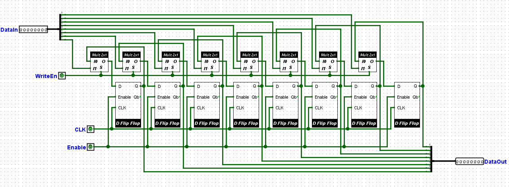
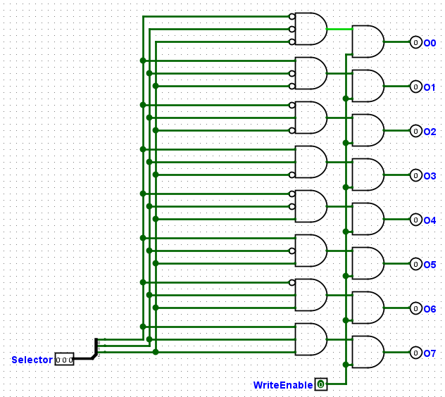
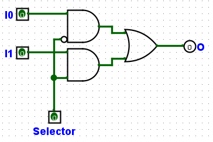
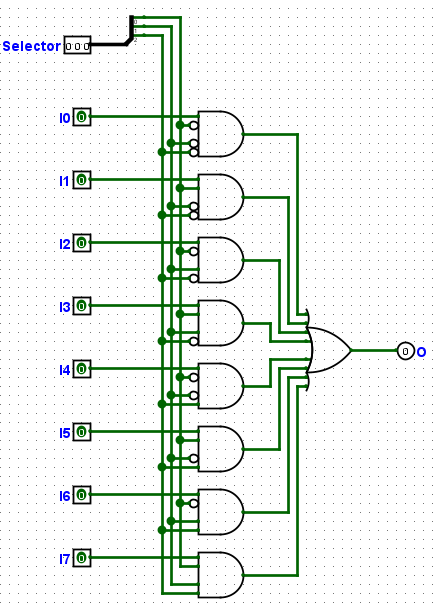
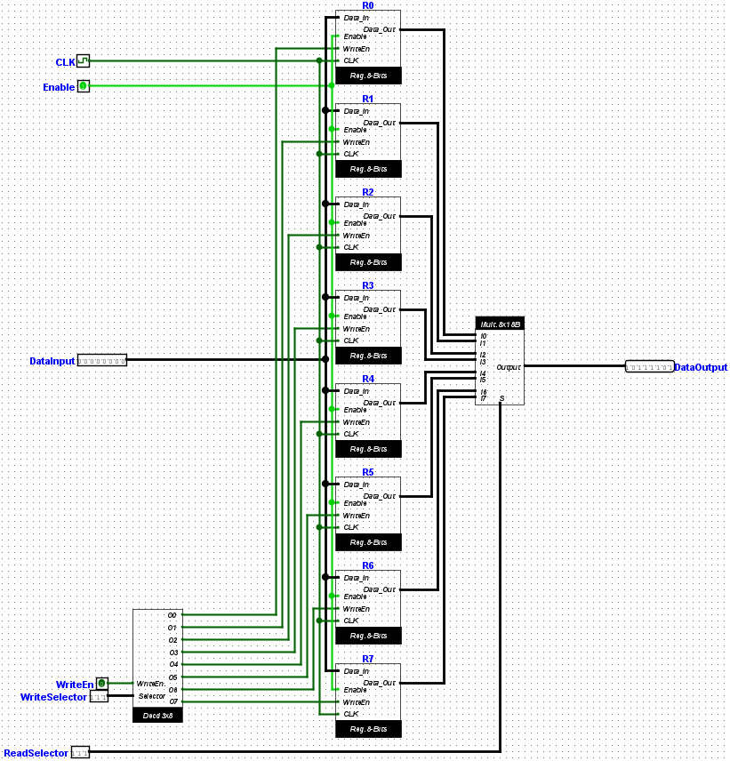

# Banco de Registradores de 8 Bits

## 🔍 Descrição

O Banco de Registradores de 8 Bits é uma unidade que permite armazenar e acessar dados em 8 registradores independentes. Ele utiliza componentes modulares, como Flip-Flops D, Decoders e Multiplexadores, para realizar operações de leitura e escrita de forma controlada.

---

## 🖥️ Componentes

### 1. Flip-Flop D com Enable

- **Descrição**:
  - Cada Flip-Flop D pode armazenar 1 bit e possui uma entrada adicional de controle chamada `Enable`. Este controle garante que os dados sejam escritos apenas quando habilitados.
- **Lógica**:
  - Quando `Enable = 1`, o Flip-Flop armazena o valor de entrada (`D`) na borda de subida do clock.
  - Quando `Enable = 0`, o valor armazenado permanece inalterado.
- **Para mais detalhes sobre o funcionamento do Flip-Flop D, consulte [Registrador Flip Flop](./registrador-flip-flop.md)**.

---

### 2. Registrador de 8 Bits

- **Descrição**:
  - Um registrador de 8 bits é formado por 8 Flip-Flops D, cada um controlado pelo seu próprio `Enable`.
  - Inclui dois barramentos de 8 bits:
    - **Entrada (Data Input)**: Fornece os dados a serem armazenados.
    - **Saída (Data Output)**: Contém o valor armazenado no registrador.
  - Inclui um multiplexador 2x1 para controlar a operação de escrita.
- **Lógica**:
  - O multiplexador 2x1 permite que o registrador escolha entre:
    - Escrever novos dados.
    - Manter os dados armazenados.
  - Quando o sinal de escrita está desativado (`Write = 0`), o registrador mantém o valor atual.
- **Imagem**:
  - 

---

### 3. Decoder 3x8

- **Descrição**:
  - O decodificador 3x8 converte 3 bits de entrada em um dos 8 sinais de saída, habilitando um único registrador entre os 8 disponíveis.
  - Possui um sinal adicional de `Write Enable` para habilitar o controle de escrita.
- **Lógica**:
  - Com `Write Enable = 1`, o registrador correspondente ao seletor (`Write Selector`) será ativado.
  - As saídas são conectadas aos input de `WriteEn` dos registradores.
- **Imagem**:
  - 

---

### 4. Multiplexadores

#### Multiplexador 2x1

- **Descrição**:
  - Este multiplexador permite selecionar entre dois sinais de entrada de 1 bit, com base no sinal de controle.
  - Usado nos registradores para decidir entre manter os dados atuais ou escrever novos dados.
- **Lógica**:
  - Quando o sinal de controle é `0`, o multiplexador seleciona a entrada `I0` (dados armazenados).
  - Quando o sinal de controle é `1`, o multiplexador seleciona a entrada `I1` (novos dados a serem escritos).
- **Imagem**:
  - 

#### Multiplexador 8x1 (1 bit)

- **Descrição**:
  - Permite selecionar um dos 8 sinais de entrada de 1 bit com base no seletor de 3 bits.
- **Lógica**:
  - A saída será igual ao sinal de entrada correspondente ao seletor.
- **Imagem**:
  - 

#### Multiplexador 8x1 (8 bits)

- **Descrição**:
  - Extensão do multiplexador de 1 bit, mas com barramentos de 8 bits como entradas e saída.
- **Lógica**:
  - A saída será igual ao barramento de entrada correspondente ao seletor.
- **Imagem**:
  - 

---

## ⚙️ Implementação

### Lógica Geral do Banco de Registradores

- **Escrita**:
  - Quando `Write Enable = 1`, o `Write Selector` ativa um registrador específico via o Decoder 3x8.
  - O registrador selecionado escreve os dados fornecidos no barramento de entrada (`Data Input`).
  - Registradores não selecionados permanecem inalterados.
- **Leitura**:
  - O `Read Selector` controla o multiplexador 8x1 de 8 bits.
  - A saída do multiplexador é conectada ao barramento de saída (`Data Output`), que contém os dados do registrador selecionado.

---

### Tabela de Sinais

| Sinal            | Descrição                                                          |
| ---------------- | ------------------------------------------------------------------ |
| `Data Input`     | Barramento de 8 bits para entrada de dados na operação de escrita. |
| `Data Output`    | Barramento de 8 bits para saída de dados na operação de leitura.   |
| `Write Enable`   | Ativa a operação de escrita.                                       |
| `Write Selector` | Define qual registrador será habilitado para escrita (3 bits).     |
| `Read Selector`  | Define qual registrador será lido pelo multiplexador (3 bits).     |
| `Enable`         | Ativa todos os registradores.                                      |
| `Clock`          | Sincroniza as operações de escrita e leitura.                      |

---

## Imagem do Banco de Registradores

- 

---

## 🔬 Testes

### Método de Teste

1. **Escrita**:
   - Ativar `Write Enable` e usar o `Write Selector` para selecionar um registrador.
   - Fornecer dados no barramento de entrada (`Data Input`) e verificar se o valor é armazenado no registrador correto.
2. **Leitura**:
   - Usar o `Read Selector` para selecionar um registrador.
   - Verificar se o valor correto aparece no barramento de saída (`Data Output`).
3. **Validação**:
   - Testar combinações de escrita e leitura para verificar a integridade dos dados.

### Resultados dos Testes

| Ação     | Write Enable | Write Selector | Read Selector | Data Input | Data Output |
| -------- | ------------ | -------------- | ------------- | ---------- | ----------- |
| Escrever | 1            | `000`          | ---           | `10101010` | ---         |
| Ler      | 0            | ---            | `000`         | ---        | `10101010`  |
| Escrever | 1            | `011`          | ---           | `11110000` | ---         |
| Ler      | 0            | ---            | `011`         | ---        | `11110000`  |

---

## 📈 Análise

- **Resultados Obtidos**:
  - O Banco de Registradores armazenou e leu os valores corretamente em todas as combinações testadas.
- **Observações**:
  - O uso de componentes modulares, como o Decoder 3x8 e os Multiplexadores, torna o design escalável e eficiente.
  - O controle de `Enable` garante que os registradores operem apenas quando necessário.
  - É necessário dar um pulso de clock para tirar todos os D Flip Flops do estado de erro, consequentemente tirar os registradores e enfim todo o banco como um todo, para enfim poder usá-los. [Observação sobre o funcionamento do Flip-Flop D.](./registrador-flip-flop.md#observações)

---

## 📂 Arquivos Relacionados

- [Banco de Registradores de 8 Bits (Logisim Evolution)](../src/banco_registradores_8bits.circ)
