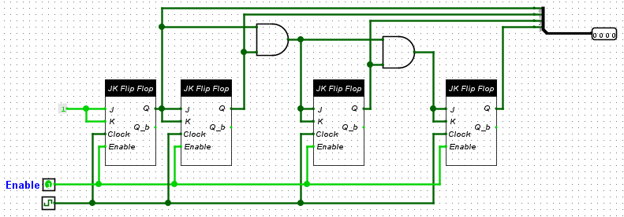

# Contador Síncrono

## 🔍 Descrição

O **Contador Síncrono** é um circuito utilizado para contar de 0 (`0000`) até 15 (`1111`) em binário, utilizando um barramento de 4 bits como saída. Ele foi implementado com **Flip-Flops JK**, todos sincronizados pelo mesmo sinal de clock. Cada Flip-Flop possui uma entrada de habilitação (_enable_), permitindo o controle preciso do funcionamento do contador.

---

## 🖥️ Componentes

- **Flip-Flops JK** com habilitação (_enable_):
  - Configurados para alternar seu estado com base no sinal de clock e no estado das entradas `J` e `K`.
  - Para saber mais sobre JK Flip Flops, confira sua [Documentação](./registrador-flip-flop.md)
- **Barramento de 4 bits**:
  - Representa a contagem atual do contador.
- **Portas Lógicas AND**:
  - Usadas para combinar os estados dos Flip-Flops e habilitar corretamente os Flip-Flops subsequentes.
- **Sinal de Clock (CLK)**:
  - Garante o sincronismo entre os Flip-Flops.

---

## ⚙️ Implementação

1. **Descrição do Circuito**:

   - **Entradas**:
     - **CLK (Clock)**: Sinal sincronizado que controla a alternância de estados dos Flip-Flops.
     - **Enable**: Permite habilitar ou desabilitar o contador.
   - **Saídas**:
     - **Barramento de 4 bits**: Representa a contagem binária atual do circuito.
   - **Lógica**:
     - **Primeiro Flip-Flop (LSB)**:
       - Sempre habilitado quando o _enable_ está ativo.
       - Alterna seu estado (toggle) a cada pulso de clock, pois as entradas `J` e `K` estão configuradas como 1.
     - **Demais Flip-Flops**:
       - Cada Flip-Flop alterna seu estado com base no estado do Flip-Flop anterior e no _enable_.
       - Portas AND são usadas para combinar o estado dos Flip-Flops anteriores e gerar o sinal de habilitação para os Flip-Flops subsequentes:
         - O segundo Flip-Flop é habilitado apenas quando o primeiro está em estado `1`.
         - O terceiro Flip-Flop é habilitado apenas quando o primeiro e o segundo estão em estado `1`.
         - O quarto Flip-Flop é habilitado apenas quando os três anteriores estão em estado `1`.
     - **Respeito ao Overflow**:
       - Após atingir `1111`, o contador retorna ao estado `0000` naturalmente devido ao comportamento dos Flip-Flops.

2. **Imagem do Circuito**:
   - 

---

## 🔬 Testes

1. **Método de Teste**:

   - Foram aplicados pulsos de clock ao circuito enquanto o sinal de habilitação (_enable_) estava ativo.
   - Foram observadas as saídas do barramento de 4 bits para verificar a contagem binária correta.
   - Também foram testados cenários onde o _enable_ foi desativado para garantir que o contador parasse.

2. **Resultados dos Testes**:
   - **Tabela Verdade Completa**:
     | Clock (Pulso) | Enable | Saída (4 bits) | Descrição |
     |---------------|--------|----------------|-------------------|
     | 0 | 1 | `0000` | Estado inicial |
     | 1 | 1 | `0001` | Incrementa 1 |
     | 2 | 1 | `0010` | Incrementa 1 |
     | 3 | 1 | `0011` | Incrementa 1 |
     | 4 | 1 | `0100` | Incrementa 1 |
     | 5 | 1 | `0101` | Incrementa 1 |
     | 6 | 1 | `0110` | Incrementa 1 |
     | 7 | 1 | `0111` | Incrementa 1 |
     | 8 | 1 | `1000` | Incrementa 1 |
     | 9 | 1 | `1001` | Incrementa 1 |
     | 10 | 1 | `1010` | Incrementa 1 |
     | 11 | 1 | `1011` | Incrementa 1 |
     | 12 | 1 | `1100` | Incrementa 1 |
     | 13 | 1 | `1101` | Incrementa 1 |
     | 14 | 1 | `1110` | Incrementa 1 |
     | 15 | 1 | `1111` | Estado máximo |
     | 16 | 1 | `0000` | Reinicia contagem |
     | X | 0 | `----` | Contador pausado |

---

## 📈 Análise

- **Resultados Obtidos**:
  - O contador alternou corretamente entre os estados, respeitando a sequência binária de `0000` a `1111`.
  - O contador pausou quando o sinal de habilitação (_enable_) foi desativado, confirmando a funcionalidade correta.
- **Observações**:
  - O uso de Flip-Flops JK com _enable_ e portas AND garantiu controle preciso sobre os estados subsequentes.
  - O sincronismo entre os Flip-Flops eliminou condições de _glitch_ ou estados inválidos.
  - É necessário dar um pulso de clock para tirar todos os JK Flip Flops do estado de erro para enfim poder usá-los. [Observação sobre o funcionamento do Flip-Flop JK.](./registrador-flip-flop.md#observações)

---

## 📂 Arquivos Relacionados

- [Arquivo do Logisim Evolution](../src/contador_sincrono.circ)
