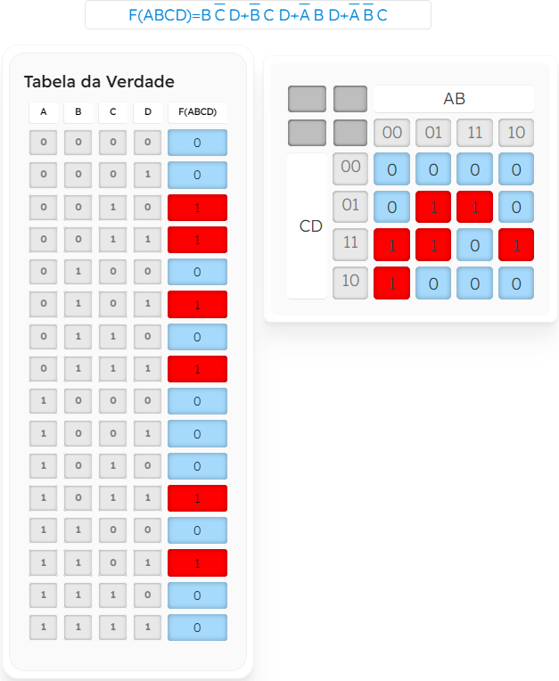
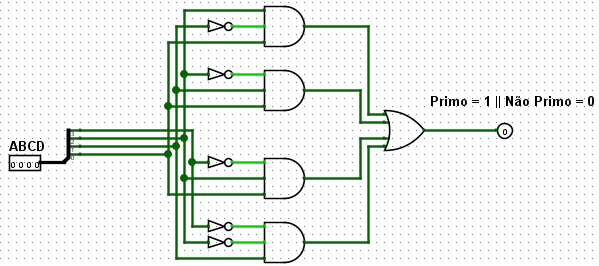

# Detector de Número Primo (4 bits)

## 🔍 Descrição

Este circuito é um **Detector de Número Primo** que identifica se uma entrada binária de 4 bits representa um número primo. Um número primo é definido como um número natural maior que 1 que não pode ser dividido por nenhum outro número além de 1 e ele mesmo.

### Objetivo

Detectar números primos na entrada binária (4 bits) e produzir:

- Saída `1` se o número for primo.
- Saída `0` se o número não for primo.

---

## 🖥️ Componentes

- **Entradas**:
  - 4 bits (ABCD, onde `A` é o bit mais significativo e `D` o menos significativo).
- **Portas Lógicas**:
  - **NOT**: Inversão de sinais para construção das condições.
  - **AND**: Combinação de condições para identificar números primos.
  - **OR**: Combinação final dos resultados das condições.

---

## ⚙️ Implementação

1. **Descrição do Circuito**:

   - **Entradas**:
     - 4 bits de entrada (representando números de 0 a 15).
   - **Saída**:
     - Um único bit:
       - `1` indica que o número é primo.
       - `0` indica que o número não é primo.
   - **Lógica**:
     - Utilizou-se **Mapas de Karnaugh** para simplificar a lógica que detecta números primos (2, 3, 5, 7, 11, 13).
     - As expressões lógicas foram implementadas com portas **NOT**, **AND** e **OR**.

2. **Mapa de Karnaugh**:

   - Abaixo está o mapa de Karnaugh utilizado para simplificar a lógica do circuito:
     - 
     - Para ver em mais detalhes os agrupamentos, faça o em [MakerHero](https://www.makerhero.com/blog/mapa-de-karnaugh/)

3. **Imagem do Circuito**:
   - 

---

## 🔬 Testes

1. **Método de Teste**:

   - Foram inseridos valores binários de 4 bits, representando números de 0 a 15.
   - A saída foi observada para verificar se correspondia corretamente à detecção de números primos.

2. **Resultados dos Testes**:
   - **Tabela Verdade**:
     | Entrada (ABCD) | Decimal | Primo? | Saída |
     |----------------|---------|--------|-------|
     | `0000` | 0 | Não | 0 |
     | `0001` | 1 | Não | 0 |
     | `0010` | 2 | Sim | 1 |
     | `0011` | 3 | Sim | 1 |
     | `0100` | 4 | Não | 0 |
     | `0101` | 5 | Sim | 1 |
     | `0110` | 6 | Não | 0 |
     | `0111` | 7 | Sim | 1 |
     | `1000` | 8 | Não | 0 |
     | `1001` | 9 | Não | 0 |
     | `1010` | 10 | Não | 0 |
     | `1011` | 11 | Sim | 1 |
     | `1100` | 12 | Não | 0 |
     | `1101` | 13 | Sim | 1 |
     | `1110` | 14 | Não | 0 |
     | `1111` | 15 | Não | 0 |

---

## 📈 Análise

- **Resultados Obtidos**:
  - O circuito detectou corretamente os números primos entre 0 e 15.
  - Para entradas não-primas, a saída foi `0`, e para entradas primas, a saída foi `1`.
- **Observações**:
  - A lógica baseada em mapas de Karnaugh simplificou a detecção, reduzindo o número de portas necessárias.
  - A solução funciona corretamente para entradas dentro do intervalo especificado (0 a 15).

---

## 📂 Arquivos Relacionados

- [Arquivo do Logisim Evolution](../src/detector_primo.circ)
