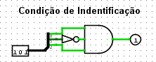
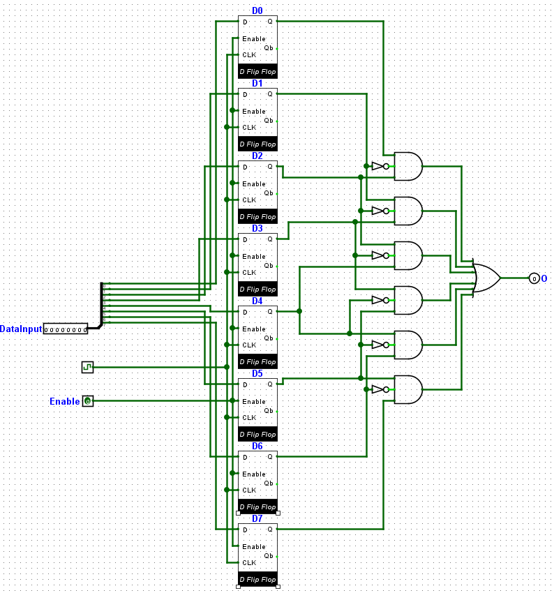

# Detector de Sequência Binária para "101"

## 🔍 Descrição

Este circuito foi projetado para identificar a sequência binária "101" em um fluxo de entrada de 8 bits. Ele utiliza Flip-Flops D com `Enable` para armazenar cada bit do fluxo de entrada e portas lógicas AND e NOT para realizar a verificação da sequência em grupos de 3 bits consecutivos.

---

## 🖥️ Componentes

- **Flip-Flop D com Enable**:
  - Utilizado para armazenar cada bit do fluxo de entrada.
  - Possui um sinal `Enable` que controla quando o valor de entrada é armazenado.
- **Barramento de 8 bits**:
  - Representa o fluxo de entrada que será analisado.
- **Portas AND com 3 entradas**:
  - Usadas para identificar a sequência "101".
- **Portas NOT**:
  - Invertendo os bits necessários no meio da sequência.

---

## ⚙️ Implementação

### Lógica do Detector de Sequência

1. **Entrada**:
   - Um barramento de 8 bits é conectado ao circuito, representando o fluxo de dados binários.
2. **Armazenamento**:
   - O barramento de 8 bits é armazenado em 8 Flip-Flops D.
   - Cada Flip-Flop armazena um bit individual do fluxo, sincronizado pelo clock e controlado pelo `Enable`.
3. **Verificação da Sequência**:
   - A sequência "101" é identificada utilizando:
     - **3 bits consecutivos** do fluxo de entrada.
     - **6 portas AND**, cada uma configurada para analisar combinações específicas de 3 bits consecutivos.
     - O bit do meio da sequência ("0" em "101") passa por uma porta NOT antes de entrar na AND correspondente.
     - Veja a imagem abaixo com a condição de verificação da sequência:
       - 
4. **Saída**:
   - Quando a sequência "101" é detectada em qualquer posição dos 8 bits, a saída correspondente da porta AND será ativada (1).
   - O circuito pode identificar a sequência em várias posições ao mesmo tempo, desde que o fluxo de entrada esteja dentro do limite do barramento de 8 bits.

### **Imagem do Circuito**



- A imagem acima mostra a implementação do detector de sequência "101". Cada bloco representa os Flip-Flops D e as portas lógicas necessárias para identificar a sequência nos grupos de 3 bits consecutivos.
- O barramento de entrada de 8 bits é visível à esquerda, enquanto as saídas das portas AND são exibidas no lado direito.

---

### Exemplo de Lógica para Identificação da Sequência

Considere os bits consecutivos armazenados nos Flip-Flops `D0`, `D1`, e `D2`:

- A sequência "101" é detectada com a seguinte lógica:

  ```text
  (D0 AND NOT D1 AND D2)
  ```

- O mesmo processo é repetido para os próximos conjuntos de bits consecutivos:
  - `(D1 AND NOT D2 AND D3)`
  - `(D2 AND NOT D3 AND D4)`
  - E assim por diante, até `(D5 AND NOT D6 AND D7)`.

---

## 🔬 Testes

### Método de Teste

1. **Configuração do Circuito**:

   - Insira diferentes combinações no barramento de 8 bits (`DataInput`).
   - Observe as saídas das portas AND para identificar quando a sequência "101" é detectada.

2. **Validação**:
   - Use padrões de entrada conhecidos para verificar se o circuito detecta a sequência nas posições corretas.
   - **Exemplo**: Para o fluxo de entrada `11010111`, a sequência "101" deve ser detectada nas posições 1 a 3 e 3 a 5.

---

### Resultados dos Testes

| Fluxo de Entrada (`Input Flux`) | Posições com "101" Detectado | Saídas Ativadas |
| ------------------------------- | ---------------------------- | --------------- |
| `11010111`                      | Posição 1-3, 3-5             | `AND2`, `AND4`  |
| `10100000`                      | Posição 0-2                  | `AND5`          |
| `00000000`                      | Nenhuma                      | Nenhuma         |
| `11111111`                      | Nenhuma                      | Nenhuma         |

---

## 📈 Análise

- **Resultados Obtidos**:
  - O circuito detectou corretamente a sequência "101" em todas as posições testadas.
  - As saídas das portas AND indicaram as posições onde a sequência foi encontrada.
- **Observações**:
  - O uso de Flip-Flops D com `Enable` permite armazenar e sincronizar o fluxo de entrada de forma eficiente.
  - O design modular das portas AND facilita a escalabilidade para fluxos maiores ou outras sequências.
  - É necessário dar um pulso de clock para tirar todos os D Flip Flops do estado de erro para enfim poder usá-los. [Observação sobre o funcionamento do Flip-Flop D.](./registrador-flip-flop.md#observações)

---

## 📂 Arquivos Relacionados

- [Detector de Sequência Binária (Logisim Evolution)](../src/detector_sequencia_101.circ)
