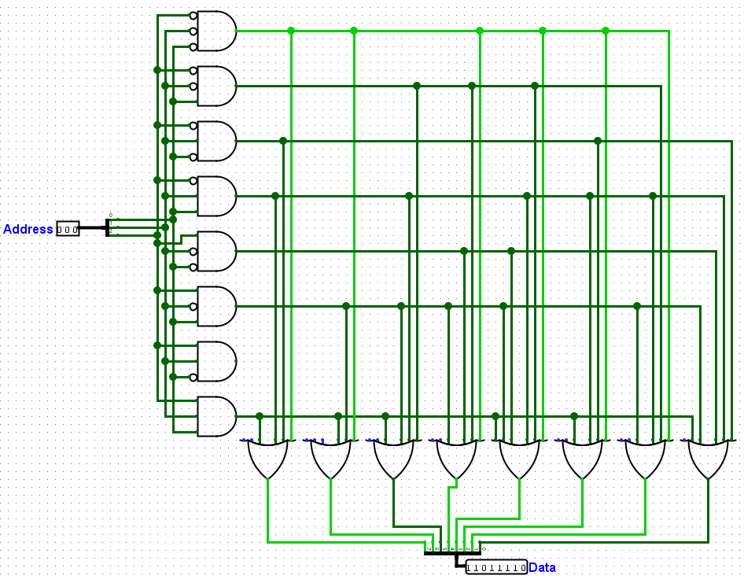

# Memória ROM de 8 Bits

## 🔍 Descrição

A Memória ROM (Read-Only Memory) de 8 bits é um circuito que armazena dados fixos. Este projeto utiliza um barramento de 3 bits como endereço de entrada para acessar os 8 bits de dados correspondentes na saída. A ROM é implementada utilizando um splitter, portas AND e OR, para mapear os endereços aos dados.

---

## 🖥️ Componentes

- **Barramento de 3 bits**:
  - Utilizado como entrada para selecionar o endereço.
- **Splitter (Distribuidor)**:
  - Divide o barramento de 3 bits em sinais individuais para controle lógico.
- **Portas Lógicas (AND e OR)**:
  - Configuradas para mapear cada combinação de endereço aos respectivos dados.
- **Barramento de 8 bits (data)**:
  - Saída correspondente aos 8 bits armazenados no endereço selecionado.

---

## ⚙️ Implementação

### **Lógica da ROM**

- O circuito usa um **barramento de 3 bits** como entrada (digamos `A2`, `A1`, `A0` para representar cada bit) para selecionar um dos 8 endereços disponíveis.
- Cada endereço é associado a uma linha de dados fixa (8 bits).
- As portas AND são usadas para ativar uma linha de dados específica com base no endereço.
- As portas OR combinam as saídas das portas AND para formar os bits da saída.

#### **Imagem do Circuito**

- Abaixo está o diagrama do circuito da Memória ROM de 8 bits implementado:
  - 

#### **Exemplo de Lógica para `data[0]` (primeiro bit do barramento de saída)**

- Para gerar o valor do primeiro bit do barramento de saída (`data[0]`):
  - Consulte a tabela de endereços e observe quais endereços têm `data[0] = 1`:
    | Endereço (`address`) | `data[0]` | `data[1]` | `data[2]` | `data[3]` | `data[4]` | `data[5]` | `data[6]` | `data[7]` | `data[8]` |
    |----------------------|-----------|-----------|-----------|-----------|-----------|-----------|-----------|-----------|-----------|
    | `000` | `1` | `1` | `0` | `1` | `1` | `1` | `1` | `0` |
    | `001` | `0` | `0` | `1` | `1` | `1` | `0` | `1` | `0` |
    | `010` | `1` | `0` | `0` | `0` | `0` | `1` | `0` | `1` |
    | `011` | `1` | `0` | `1` | `0` | `1` | `1` | `1` | `1` |
    | `100` | `0` | `0` | `0` | `1` | `1` | `0` | `0` | `1` |
    | `101` | `0` | `1` | `1` | `1` | `1` | `0` | `1` | `1` |
    | `110` | `0` | `0` | `0` | `0` | `0` | `0` | `0` | `0` |
    | `111` | `1` | `1` | `1` | `0` | `1` | `1` | `0` | `1` |
  - A lógica para `data[0]` será:
    ```text
    data[0] = (NOT A2 AND NOT A1 AND NOT A0) OR
              (NOT A2 AND A1 AND NOT A0) OR
              (NOT A2 AND A1 AND A0) OR
              (A2 AND A1 AND A0)
    ```

#### **Como Funciona**

- Cada combinação de `A2`, `A1`, `A0` ativa exatamente uma porta AND, que mapeia o endereço à linha correspondente de dados.
- As portas OR combinam essas saídas para formar os bits do barramento de saída (`data`).

---

### **Tabela de Endereços e Dados**

- Cada combinação do barramento de 3 bits corresponde a um conjunto fixo de 8 bits:
  | Endereço (`address`) | Dados (`data`) |
  |----------------------|-----------------|
  | `000` | `11011110` |
  | `001` | `00111010` |
  | `010` | `10000101` |
  | `011` | `10101111` |
  | `100` | `00011001` |
  | `101` | `01111011` |
  | `110` | `00000000` |
  | `111` | `11101101` |

---

## 🔬 Testes

1. **Método de Teste**:

   - Para cada combinação do barramento de entrada (`address`), o barramento de saída (`data`) foi comparado com os valores esperados na tabela de endereços e dados.
   - O circuito foi testado no Logisim Evolution e sua tabela verdade foi validada a partir da função de análise combinacional presente no ambiente.

2. **Resultados dos Testes**:
   - **Tabela Verdade**:
     | Entrada (`address`) | Saída (`data`) |
     |---------------------|-----------------|
     | `000` | `11011110` |
     | `001` | `00111010` |
     | `010` | `10000101` |
     | `011` | `10101111` |
     | `100` | `00011001` |
     | `101` | `01111011` |
     | `110` | `00000000` |
     | `111` | `11101101` |

---

## 📈 Análise

- **Resultados Obtidos**:
  - O circuito apresentou os dados corretos para cada endereço de entrada, validando a lógica implementada com AND e OR.
- **Observações**:
  - A utilização de portas lógicas permite maior controle sobre os dados armazenados e facilita a implementação em escalas maiores.
  - O uso de um splitter para dividir o barramento de entrada em sinais individuais simplifica a lógica do circuito.

---

## 📂 Arquivos Relacionados

- [Memória ROM 8 bits (Logisim)](../src/memoria_rom_8_bits.circ)
