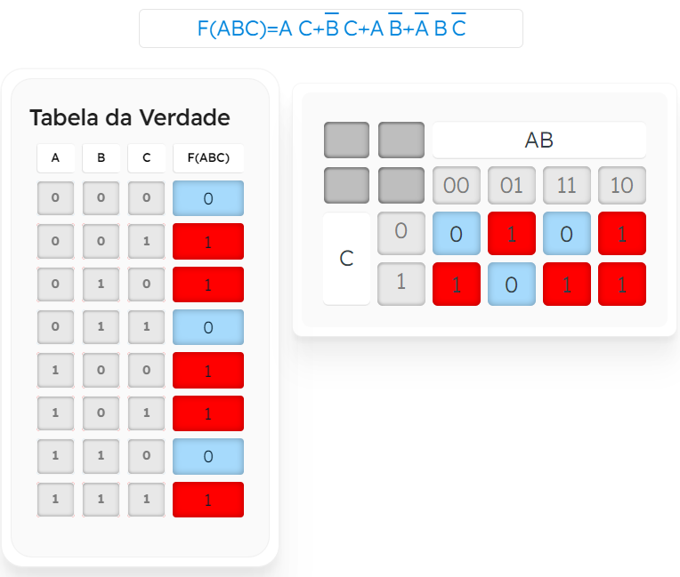
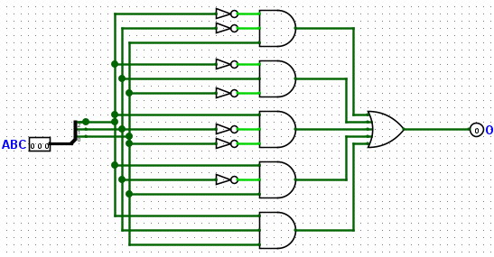
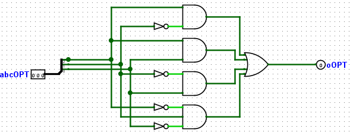

# Otimização Lógica Utilizando Mapas de Karnaugh

## 🔍 Descrição

Este exercício tem como objetivo resolver um problema de lógica combinacional utilizando **Mapas de Karnaugh** para simplificar as expressões booleanas e, em seguida, implementar os circuitos antes e depois da otimização. A otimização reduz o número de portas lógicas e conexões, tornando o circuito mais eficiente em termos de hardware.

---

## 🖥️ Componentes

- **Portas Lógicas**:
  - NOT
  - AND
  - OR
- **Entradas**:
  - A, B, C (3 bits de entrada).
- **Saídas**:
  - O (sem otimização).
  - oOPT (com otimização).

---

## ⚙️ Implementação

1. **Descrição do Circuito**:

   - O circuito inicial foi projetado sem otimização, implementando a expressão booleana diretamente com base na tabela verdade.
   - Após a análise com Mapas de Karnaugh, a expressão foi simplificada para reduzir o número de portas lógicas e conexões.

2. **Expressões Booleanas e Mapa de Karnaugh**:

   - **Tabela Verdade**:
     | A | B | C | F(A, B, C) |
     |---|---|---|------------|
     | 0 | 0 | 0 | 0 |
     | 0 | 0 | 1 | 1 |
     | 0 | 1 | 0 | 1 |
     | 0 | 1 | 1 | 0 |
     | 1 | 0 | 0 | 1 |
     | 1 | 0 | 1 | 1 |
     | 1 | 1 | 0 | 0 |
     | 1 | 1 | 1 | 1 |

   - **Mapa de Karnaugh**:
     Para simplificar `F(A, B, C)`, foi utilizado o Mapa de Karnaugh para identificar e combinar os termos mínimos.

   - **Imagem do Mapa de Karnaugh**:
     - 
     - Deseja ver com mais detalhes os agrupamentos, faça o em [MakerHero](https://www.makerhero.com/blog/mapa-de-karnaugh/)
   - **Expressões Booleanas**:

     - **Sem Otimização**:
       ```text
       F(A, B, C) = (NOT A AND NOT B AND C) OR (NOT A AND B AND NOT C) OR (A AND NOT B AND NOT C) OR (A AND NOT B AND C) OR (A AND B AND C)
       ```
     - **Com Otimização (após Karnaugh)**:
       ```text
       F(A, B, C) = (A AND NOT B) OR (A AND C) OR (NOT B AND C) OR (NOT A AND B AND NOT C)
       ```

3. **Imagem do Circuito**:
   - **Sem Otimização**:
     - 
   - **Com Otimização**:
     - 

---

## 🔬 Testes

1. **Método de Teste**:

   - A tabela verdade foi usada para validar ambas as implementações, verificando se as saídas `O` e `oOPT` produzem os mesmos resultados para todas as combinações de entrada.

2. **Resultados dos Testes**:
   - **Tabela Verdade**:
     | A | B | C | F(A, B, C) Sem Otimização | F(A, B, C) Com Otimização |
     |---|---|---|---------------------------|---------------------------|
     | 0 | 0 | 0 | 0 | 0 |
     | 0 | 0 | 1 | 1 | 1 |
     | 0 | 1 | 0 | 1 | 1 |
     | 0 | 1 | 1 | 0 | 0 |
     | 1 | 0 | 0 | 1 | 1 |
     | 1 | 0 | 1 | 1 | 1 |
     | 1 | 1 | 0 | 0 | 0 |
     | 1 | 1 | 1 | 1 | 1 |

---

## 📈 Análise

- **Resultados Obtidos**:

  - As saídas do circuito sem otimização e do circuito otimizado produziram resultados idênticos, validando a simplificação realizada.
  - O circuito otimizado utilizou um número significativamente menor de portas lógicas, reduzindo a complexidade e o consumo de recursos.

- **Observações**:
  - A otimização do circuito com Mapas de Karnaugh demonstrou ser eficaz para simplificar a expressão booleana.
  - A implementação otimizada é mais eficiente em termos de hardware e desempenho, especialmente em projetos de larga escala.

---

## 📂 Arquivos Relacionados

- [Arquivo do Circuito Sem e Com Otimização (Logisim Evolution)](../src/circuito_sem_e_com_otimizacao.circ)
