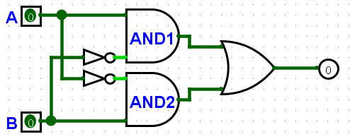

# Porta Lógica XOR usando AND, NOT e OR

## 🔍 Descrição

Uma porta lógica XOR (OU Exclusivo) retorna verdadeiro (1) quando as entradas são diferentes, e falso (0) quando são iguais. Neste exercício, a porta XOR foi implementada utilizando componentes básicos: AND, NOT e OR.

---

## 🖥️ Componentes

- **Porta AND**:
  - Usada para identificar as combinações em que as entradas devem ser diferentes.
- **Porta NOT**:
  - Inverte o valor lógico das entradas.
- **Porta OR**:
  - Combina os resultados das operações intermediárias para gerar a saída final.

---

## ⚙️ Implementação

1. **Descrição do Circuito**:

   - **Entradas**:
     - `A` (1 bit): Primeira entrada lógica.
     - `B` (1 bit): Segunda entrada lógica.
   - **Saídas**:
     - `XOR (A ⊕ B)` (1 bit): Resultado da operação OU Exclusivo.
   - **Lógica**:
     - A lógica XOR é definida pela equação:
       ```
       A ⊕ B = (A AND NOT B) OR (NOT A AND B)
       ```
     - Conexões do circuito:
       - O valor `NOT A` (saída de uma porta NOT) é conectado como entrada para a segunda porta AND (chamemos de AND2).
       - O valor `NOT B` (saída de outra porta NOT) é conectado como entrada para a primeira porta AND (chamemos de AND1).
       - As duas portas AND avaliam as seguintes expressões:
         - `A AND NOT B`
         - `NOT A AND B`
       - Uma porta OR combina os resultados das duas portas AND para produzir a saída final.

2. **Imagem do Circuito**:
   - 

---

## 🔬 Testes

1. **Método de Teste**:

   - Foram utilizadas todas as combinações possíveis de entrada (0 e 1) para `A` e `B`.
   - A saída foi comparada com a tabela verdade da operação XOR.

2. **Resultados dos Testes**:
   - **Tabela Verdade**:
     | Entrada `A` | Entrada `B` | Saída `A ⊕ B` |
     |-------------|-------------|---------------|
     | 0 | 0 | 0 |
     | 0 | 1 | 1 |
     | 1 | 0 | 1 |
     | 1 | 1 | 0 |

---

## 📈 Análise

- **Resultados Obtidos**:
  - O circuito implementado apresentou resultados consistentes com a operação XOR esperada.
  - Cada etapa lógica foi devidamente mapeada e validada com a tabela verdade.
- **Observações**:
  - A implementação com AND, NOT e OR é modular e demonstra como portas lógicas básicas podem ser combinadas para criar operações mais complexas.

---

## 📂 Arquivos Relacionados

- [Arquivo do Logisim Evolution](../src/porta_xor_and_not_or.circ)
