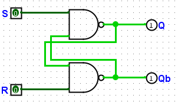
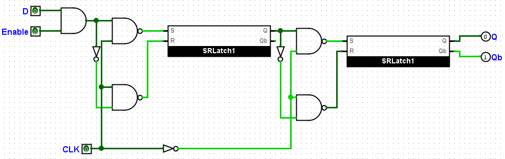
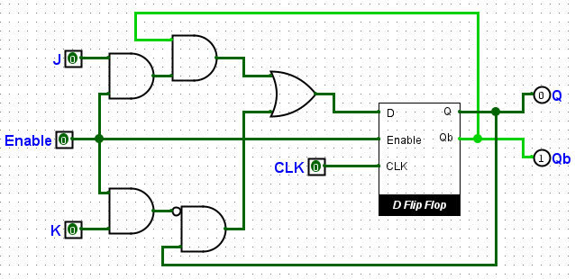

# Registrador Flip-Flop do tipo D e do tipo JK

## 🔍 Descrição

Flip-Flops são elementos de memória essenciais em circuitos digitais, capazes de armazenar um único bit de informação. Este projeto implementa dois tipos de Flip-Flops:

1. **Flip-Flop D**:

   - Um registrador controlado por borda que simplifica o design de circuitos ao eliminar condições indesejadas de entrada.
   - Baseado em um **Master-Slave** para maior estabilidade.

2. **Flip-Flop JK**:
   - Um Flip-Flop universal que pode operar como um Flip-Flop D, T ou SR, dependendo das entradas fornecidas.
   - Implementado utilizando o **Flip-Flop D** para criar o comportamento JK.

Ambos os Flip-Flops utilizam um **SR Latch NAND** como componente fundamental.

---

## 🖥️ Componentes

- **SR Latch NAND**:
  - O núcleo básico do Flip-Flop, usado para armazenar o estado interno.
- **Flip-Flop D Master-Slave**:
  - Implementado para maior controle e precisão, garantindo que os dados sejam armazenados apenas em transições de clock.
- **Flip-Flop JK**:
  - Construído sobre o Flip-Flop D, com lógica adicional para implementar a funcionalidade JK.
- **Portas Lógicas**:
  - NAND, AND, OR, e NOT para realizar as conexões necessárias.

---

## ⚙️ Implementação

### **SR Latch NAND**

1. **Descrição do Circuito**:

   - O SR Latch NAND é o componente base para armazenar um único bit de informação. Ele utiliza duas portas NAND interligadas, formando um circuito de realimentação.
   - As entradas são chamadas de `S` (Set) e `R` (Reset), enquanto as saídas são `Q` e `Q'` (complemento de `Q`, no nosso circuito o `Q'` será sinalizado por `Qb`).

2. **Lógica**:

   - A tabela verdade do SR Latch NAND é:
     | Entrada `S` | Entrada `R` | Saída `Q` | Saída `Q'` |
     |-------------|-------------|-----------|------------|
     | 0 | 1 | 1 | 0 |
     | 1 | 0 | 0 | 1 |
     | 1 | 1 | Retém | Retém |
     | 0 | 0 | **Inválido** | **Inválido** |

   - **Funções**:
     - `S = 0`, `R = 1`: Define a saída `Q` para 1 (`Set`).
     - `S = 1`, `R = 0`: Reseta a saída `Q` para 0 (`Reset`).
     - `S = 1`, `R = 1`: Mantém o estado anterior (`Hold`).
     - `S = 0`, `R = 0`: Estado inválido, pois ambas as saídas tentam forçar o mesmo valor.

3. **Imagem do Circuito**:
   - 

---

### **Flip-Flop D**

1. **Descrição do Circuito**:

   - Um Flip-Flop Master-Slave que utiliza dois SR Latches NAND conectados em série.
   - O latch mestre captura o valor de entrada na borda de subida do clock, enquanto o latch escravo o armazena na borda de descida.

2. **Entradas**:

   - `D`: Entrada de dados.
   - `CLK`: Sinal de clock.
   - `Enable`: Ativação do Flip Flop (Veja o porquê com mais detalhes na seção [Observações](#observações)).

3. **Saídas**:

   - `Q`: Saída atual.
   - `Q'`: Complemento de `Q` (no nosso circuito o `Q'` será sinalizado por `Qb`).

4. **Lógica**:

   - O valor de `D` é propagado para `Q` apenas na transição de clock, garantindo estabilidade.

5. **Imagem do Circuito**:
   - 

---

### **Flip-Flop JK**

1. **Descrição do Circuito**:

   - Implementado sobre o Flip-Flop D, com lógica adicional para definir os comportamentos específicos do Flip-Flop JK.

2. **Entradas**:

   - `J`: Entrada de set.
   - `K`: Entrada de reset.
   - `CLK`: Sinal de clock.
   - `Enable`: Ativação do Flip Flop (Veja o porquê com mais detalhes na seção [Observações](#observações)).

3. **Saídas**:

   - `Q`: Saída atual.
   - `Q'`: Complemento de `Q` (no nosso circuito o `Q'` será sinalizado por `Qb`).

4. **Lógica**:

   - O Flip-Flop D é usado internamente com a lógica JK calculada:
     ```
     D = (J AND Q') OR (NOT K AND Q)
     ```
   - Isso transforma o Flip-Flop D em um Flip-Flop JK, com as seguintes características:
     - `J = 0`, `K = 0`: Sem mudança.
     - `J = 0`, `K = 1`: Reset.
     - `J = 1`, `K = 0`: Set.
     - `J = 1`, `K = 1`: Toggle.

5. **Imagem do Circuito**:
   - 

---

## 🔬 Testes

1. **Método de Teste**:

   - Foram realizadas simulações no Logisim para ambos os Flip-Flops.
   - Testes realizados para todas as combinações possíveis de entradas (`S`, `R`, `D`, `J`, `K`, `Enable`) e mudanças no sinal de clock (`CLK`).

2. **Resultados dos Testes**:
   - **SR Latch NAND**:
     | Entrada `S` | Entrada `R` | Saída `Q` | Saída `Q'` |
     |-------------|-------------|-----------|------------|
     | 0 | 1 | 1 | 0 |
     | 1 | 0 | 0 | 1 |
     | 1 | 1 | Retém | Retém |
   - **Flip-Flop D**:
     | Entrada `Enable` | Entrada `D` | CLK (Borda de Subida) | Saída `Q` | Saída `Q'` |
     |-------------|-------------|-----------------------|-----------|------------|
     | 1 | 0 | ↑ | 0 | 1 |
     | 1 | 1 | ↑ | 1 | 0 |
   - **Flip-Flop JK**:
     | Entrada `Enable` | Entrada `J` | Entrada `K` | CLK (Borda de Subida) | Saída `Q` | Saída `Q'` |
     |-------------|-------------|-------------|-----------------------|-----------|------------|
     | 1 | 0 | 0 | ↑ | Retém | Retém |
     | 1 | 0 | 1 | ↑ | 0 | 1 |
     | 1 | 1 | 0 | ↑ | 1 | 0 |
     | 1 | 1 | 1 | ↑ | Alterna | Alterna |

---

## 📈 Análise

- ### **Resultados Obtidos**:

  - O SR Latch NAND demonstrou comportamento consistente com sua tabela verdade.
  - O Flip-Flop D armazenou corretamente os valores de entrada `D` na transição de clock (borda de subida).
  - O Flip-Flop JK apresentou todos os comportamentos esperados (retém, set, reset, alterna) de acordo com as entradas `J` e `K`.

- ### **Observações**:
  - O uso do **SR Latch NAND** como núcleo garante estabilidade e modularidade.
  - O **SR Latch NAND** em seu estado de reter, causava bug de estado nos circuitos, sempre que houvesse a inicialização do simulador e/ou componente fosse usado. Para contornar esse problema, foi implementado um `Enable` nos dois flip flops que usavam do Latch, assim através de um pulso clock e com `Enable = 0` era possível retirar o bug de estado e todos os componentes funcionarem da devida maneira.
  - Os componentes funcionam com o resultado esperado sempre que `Enable = 1`.
  - A hierarquia de construção simplifica o desenvolvimento de Flip-Flops mais complexos.

---

## 📂 Arquivos Relacionados

- [SR Latch NAND, D Flip Flop, JK Flip Flop (Logisim Evolution)](../src/sr_latch_flipflop_d_flipflop_jk.circ)
